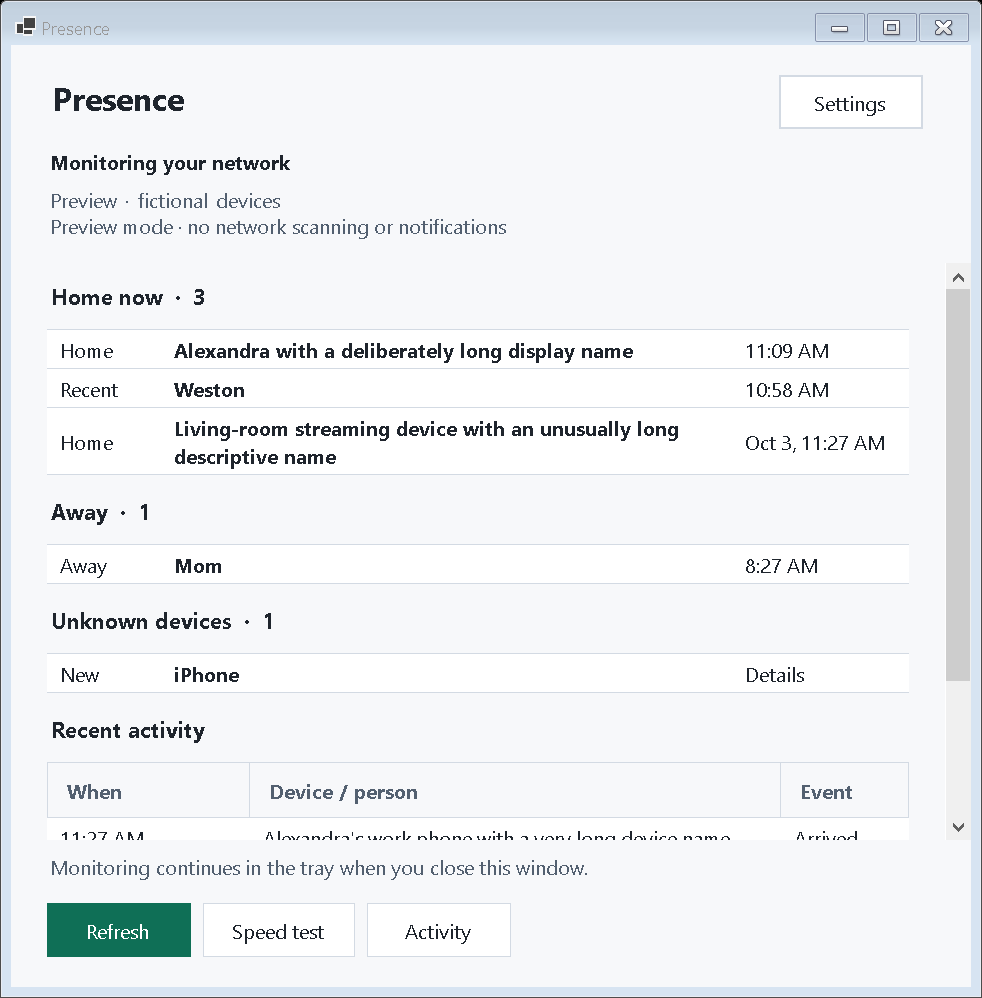
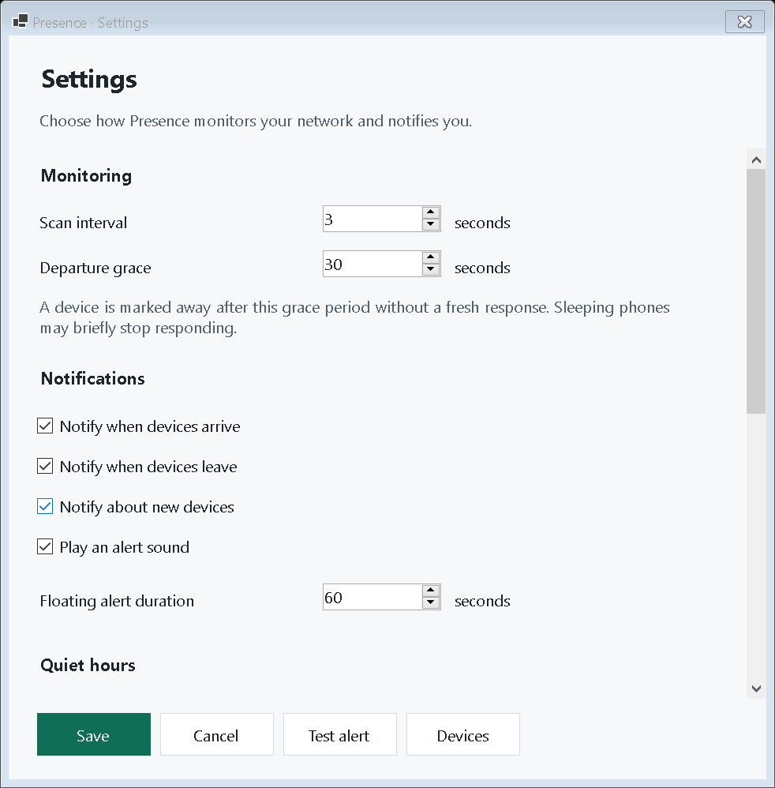
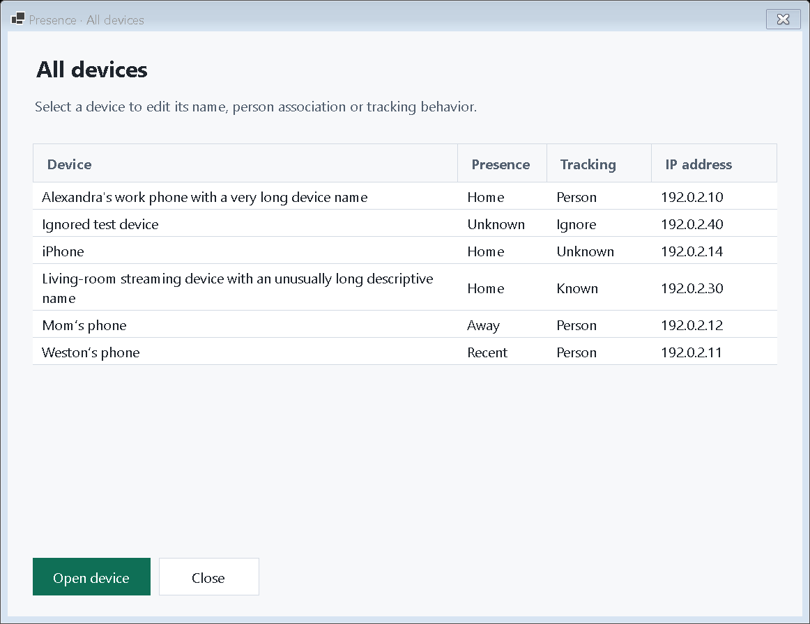
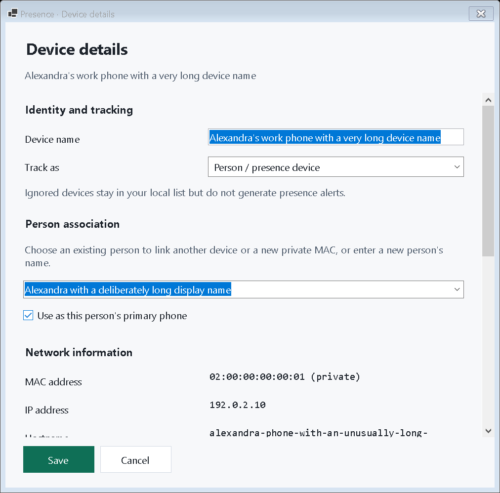
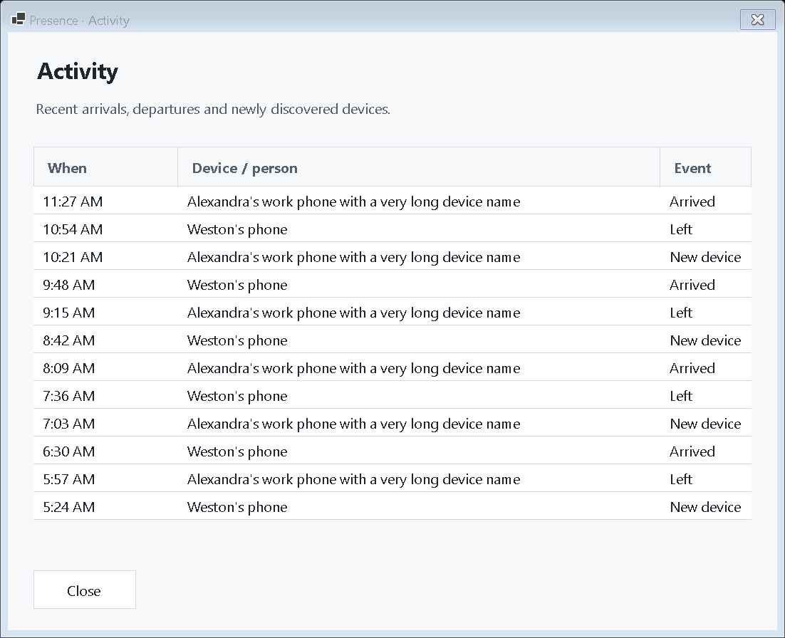
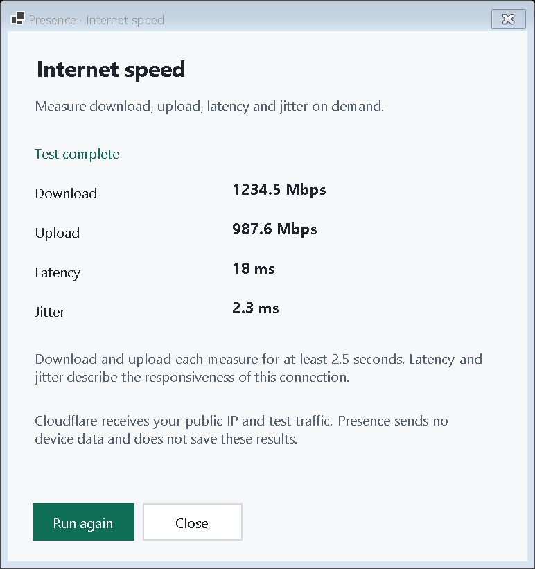

# Presence


**An open-source Fing clone for Windows, focused on who came and went.** Presence automatically watches your home network, shows arrivals and departures in the tray, and lets you connect devices with people. It is an independent project and is not affiliated with Fing.

[Download Presence 1.1.0](https://github.com/remriel/presence-windows/releases/tag/v1.1.0) · Windows 10 x64 and later




## Screenshots

These screens use fictional preview devices.











## Start

1. Extract the portable archive to a permanent folder on a local disk.
2. Launch **Presence.exe**. No administrator account or .NET runtime installation is required.
3. Allow the first silent network scan to complete. All discovered devices are tracked automatically; nothing needs approval. Optionally open a device, enter a name or associate a person, and choose their primary phone.
4. Close the window. Presence keeps running in the system tray. **Start quietly with Windows** is enabled by default; disable it in Settings if desired. Use **Quit Presence** in the tray menu to stop the background process.

Windows 10 x64 version 1809 or later is the minimum target. Current release: **1.1.0**. The release is unsigned; signing requires an owner's signing certificate. Runtime data is under `%LOCALAPPDATA%\Presence\presence.db`. The portable binary does not carry your device data.

## How it works

Presence chooses a connected physical Wi-Fi adapter first, or you can choose an adapter in Settings. It detects its local IPv4 subnet and gateway. Fresh ARP resolution supplies the principal signal, supplemented by ICMP and local mDNS replies. A cached ARP entry only supplies an address to probe; it is not counted as evidence of presence.

The default interval is **3 seconds**. The main window's **Refresh** button starts an immediate scan; Settings permits intervals from 2 to 600 seconds. Every cycle re-probes known devices and current neighbor candidates first, then actively sweeps up to 512 subnet addresses. Typical /24 and /23 home networks are covered in one pass; larger networks rotate through bounded chunks without delaying checks of known devices. Only the first successful scan is a silent baseline. The app supports physical IPv4 LANs from /16 through /30. It does not enumerate IPv6-only devices. It pauses departure inference when the gateway is unreachable or the computer suspends. There is no router-specific integration. One fresh discovery response is enough to track a device and infer arrival; no confirmation or second detection is required.

An arrival is inferred from the first fresh response. A departure requires **30 seconds** of absence during healthy monitoring by default, configurable from 10 seconds to one hour. Brief missed replies leave the device probably home. Every non-ignored device generates its own arrival/departure events, including unassigned devices and phones. An unidentified device's first join uses a single “New device joined” alert; subsequent reconnects use arrival alerts. A primary phone determines the person's presence; without a primary phone, any assigned presence device can keep them home. Person grouping does not add duplicate notifications. Known devices appear in Home Now and Away; unidentified devices appear in Unknown Devices. Ignored devices never notify. Associating a person does not require a separate device-type confirmation: enter/select the person and save.

Private MAC changes cannot safely be matched automatically. Open the new device, select the existing person, and mark it as their primary phone. This replaces the old primary while retaining its history. Manufacturer lookup uses a bundled offline IEEE OUI table; private MACs do not reveal a reliable manufacturer.

The main window has a compact **Speed test** control in its bottom bar. It measures internet download/upload speed, median HTTPS latency and jitter to Cloudflare; download and upload each measure for at least 2.5 seconds (at least five seconds total), with a 35-second timeout. Cloudflare receives your public IP and test traffic and reports collecting measurement results for aggregate internet quality insights. Presence never sends device names, MAC addresses, person mappings or history, and does not save speed results.

## Privacy and limitations

No cloud account, Presence telemetry, web server, subscriptions, login, port scanning, vulnerability scanning or packet interception. Discovery uses ARP, ICMP and a local mDNS query. The separate internet speed test connects to Cloudflare only when clicked; see the speed test privacy note below. Run it only on a network you own or have permission to monitor. History is a local SQLite database protected by the Windows user profile, not application-level encryption. Event retention defaults to 90 days; detailed observations to seven days. Ignored devices remain in local records but never produce alerts.

**Device presence is a proxy for human presence.** Sleeping phones may not respond even while associated with Wi-Fi. Client isolation, proxy ARP, private MAC changes and roaming can affect detection. A router association table could improve certainty, but Presence deliberately does not require router access. Quiet hours suppress notifications while preserving events.

Alerts are **custom floating icon popups above the taskbar**, with a bundled chime matching the Codex Usage Counter. They do not use Windows toast or balloon notifications, so disabled Windows notification banners do not suppress them. Popups stay above ordinary windows without taking keyboard focus; click one to open its device, or click × to dismiss. They close after ten seconds by default (3–60 seconds in Settings), pausing that countdown while hovered. Sound is enabled by default and can be disabled in Settings; normal Windows/app audio volume still applies. Quiet hours and the independent arrival/departure/unknown switches apply to real events. **Test alert** displays immediately even during quiet hours; it follows the saved sound setting. A bounded queue handles event bursts, with excess changes summarized while all history remains stored.

Activity shows recorded events. Settings → Devices includes known, absent and ignored devices. There is one process per user/profile; launching again opens the existing window. The tray process stays alive independently of the main window.

## Path to improvements

Presence should improve in this order, with reliability taking priority over extra features:

1. **Prove real-world detection.** Test repeated Wi-Fi off/on cycles with phones, laptops, sleeping devices, mesh Wi-Fi, and busy home networks. Measure actual join latency, leave latency, missed detections, and false departures.
2. **Make discovery adaptive.** Keep known-device probes fast, dynamically tune sweep size/concurrency to subnet size and scan duration, and avoid wasting work on addresses that have never responded.
3. **Use more LAN signals.** Add passive neighbor-change signals where Windows exposes them reliably, improve mDNS/hostname discovery, and optionally use safe broadcast discovery protocols without turning Presence into a port scanner.
4. **Improve departure confidence.** Give sleeping or intermittently reachable devices smarter grace periods based on recent behavior instead of treating every device identically.
5. **Handle network edge cases.** Add explicit diagnostics for client isolation, proxy ARP, mesh networks, multiple physical adapters, VLANs, IPv6, and networks where host-side ARP cannot see every client.
6. **Add router-assisted detection as optional integrations.** Where a router exposes a local association/client table, use it as a higher-confidence signal while keeping standalone LAN scanning as the default.
7. **Make failures visible.** Show scan duration, last successful discovery, subnet coverage, current evidence source, and a clear reason when a device cannot be observed.
8. **Harden with regression tests.** Expand automated tests around reconnect storms, scan failures, suspend/resume, interface changes, stale ARP entries, private MAC changes, and duplicate-event suppression.
9. **Optimize resource use.** Profile CPU, memory, socket use, and ARP load during long runs, then reduce work without sacrificing detection speed.
10. **Only then add polish.** Improve device naming, grouping, history, exports, and UI once the core promise is boringly reliable: a device joins, Presence sees it; a device leaves, Presence notices.

## Build and modes

Requires .NET SDK 10 on Windows:

```powershell
dotnet publish src/Presence.App/Presence.App.csproj -c Release -r win-x64 --self-contained true -p:PublishSingleFile=true -p:IncludeNativeLibrariesForSelfExtract=true -p:DebugType=None -p:DebugSymbols=false -o artifacts/portable
```

Do not trim WinForms/WinRT. `Presence.exe --tray` starts hidden. `--demo` uses fictional devices in a separate profile and disables discovery and notifications. `--preview-image C:\path\preview.png` exports the native client window with fictional devices and exits. `--preview-alert-image C:\path\alert.png` exports the custom popup with fictional text and exits without sound. `--diagnose --output C:\path\report.json` performs one local scan and writes only sanitized counts/timings, with no MAC/IP/hostname export. `--startup-trace` writes local sanitized startup phase markers, without device identifiers. `--unregister` removes legacy toast registrations; use it only when uninstalling after quitting the tray app. Disable startup in Settings before removing the portable folder.

The source separates `Presence.Core` (identity, inference, persistence), `Discovery.cs` (LAN discovery), `PresenceContext.cs` (tray, notification service, lifecycle), and `Windows.cs` (native UI).

## Release verification boundary

The current source passes deterministic core presence-state checks and the Windows publish build in GitHub Actions. Live discovery, physical phone reconnect/sleep behavior, popup click/sound behavior, and restart persistence still require manual acceptance on a real Windows LAN. Screenshots use explicitly fictional preview devices.

Manual acceptance after launch:

- Confirm your phone appears on home Wi-Fi and assign it as primary.
- Reconnect it and confirm a single arrival after its first fresh detection.
- Leave it briefly asleep and confirm no departure within the configured threshold.
- Quit and relaunch; confirm person/device mappings persist.
- Send a test alert in Settings; check the floating popup/chime and click it to open Presence.

## Sources / third-party components

- [Microsoft ResolveIpNetEntry2 documentation](https://learn.microsoft.com/en-us/previous-versions/windows/hardware/device-stage/drivers/ff570686(v=vs.85)) explains fresh ARP resolution.
- [Microsoft notification compatibility API](https://learn.microsoft.com/en-us/dotnet/api/communitytoolkit.winui.notifications.toastnotificationmanagercompat) describes native desktop toast activation.
- [IEEE OUI database](https://standards-oui.ieee.org/oui/oui.csv), bundled as a local vendor lookup snapshot downloaded October 4, 2026. The CSV remains unmodified; no runtime download occurs.
- Microsoft.Data.Sqlite / SQLitePCLRaw / SQLite and Windows Community Toolkit retain their upstream licenses. NuGet package metadata supplies license details; see THIRD_PARTY_NOTICES.md.
- The Presence application, tray and floating alert share one icon created for this release. The floating-alert chime is reused from the owner's [Codex Usage Counter](https://github.com/remriel/codex-usage-counter) `assets/milestone-alert.wav`, downloaded October 4, 2026 and embedded locally.


